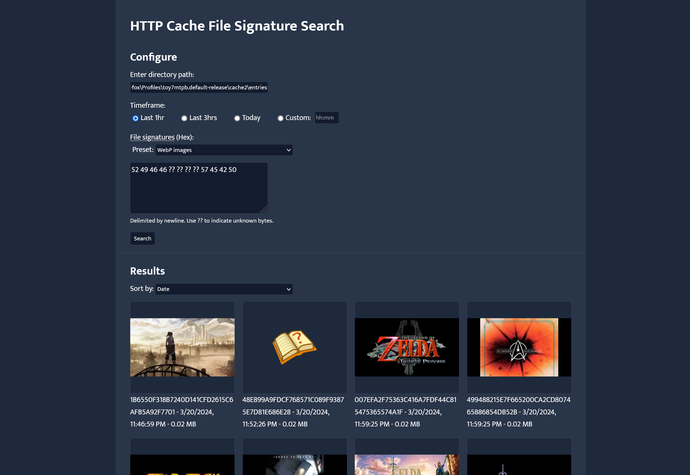
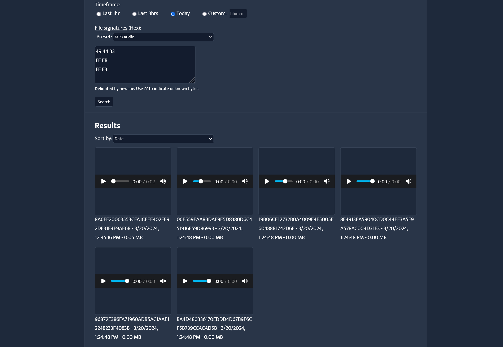

Inspect the HTTP cache of browsers or online game clients and preview image or audio assets of different formats using their [file signatures](https://en.wikipedia.org/wiki/List_of_file_signatures).

File signatures, or Magic Numbers, are sequences of bytes found at the beginning of a file that can be used to identify the file type. The caches of various applications often store HTTP responses as files without file extensions, thus this method of determining file type is useful. Some software caches responses with the HTTP headers included, though some do not. As a result the placement of the file signature within the file is not always consistent, and the headers must be removed before it can be previewed. Additionally, some file signatures contain ?? bytes, which cannot be predetermined. This application will identify and modify these files as needed to display them in the browser.

## Preview



## Installation
- Install node.js
- Open a shell/command line interface and navigate to the directory of index.js
- run ```npm install``` to install dependencies automatically
- run ```node index.js``` to start the application
- Open ```localhost:4000``` in your browser

## Example Usage
You may want to inspect the media in your browser's cache and extract something. Determine the directory of your browser's cache. For Firefox, it is usually ```C:\Users\<username>\AppData\Local\Mozilla\Firefox\Profiles\toy7mtpb.default-release\cache2\entries```. Choose a preset, and search.
